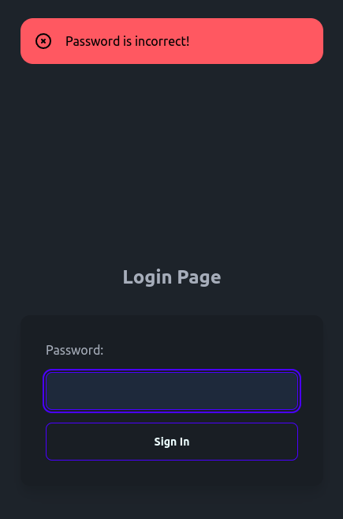
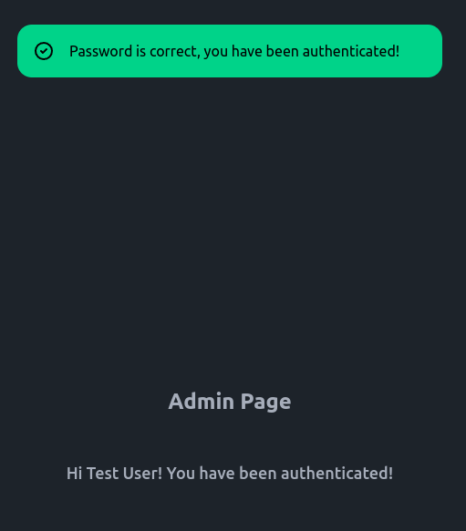

# Full Stack Golang Web App – Flash Messages Demo

#### Full-stack application simple for flash messages demonstration after page redirects, with HTML template rendering and using _hyperscript to handle deletions and transitions CSS from flash messages.

#### This is an application developed in Go with the minimalist Echo framework for the backend and the frontend rendering with the native Go template package (html/template). On the other hand, _hyperscript is used to improve the appearance of alert openings and closings. The messages remain for 5 seconds and then are automatically deleted.  Likewise, Tailwind CSS and daisyUI are used from their respective CDNs.

#### For demonstration purposes and to simplify the code, the use of a database is simulated using a function that generates a user ("Test User") and its password ("test").

#### The application has the expiration time for the token set to 1 hour. This means that after 1 hour the user session will be automatically logged out. This is something we want to avoid, especially if the user is still active and working on our resource. This can be solved by introducing a refresh token. This token will have a much longer lifespan and will be used to refresh the access token.

###### **Note**: the documentations of the Echo framework and the _hyperscript JavaScript library, you can see them [here](https://echo.labstack.com/) and [here](https://hyperscript.org/), respectively.

---

### Screenshots:

###### Login Page with errors alert:



<br>

###### Admin Page with success alert:



---

### Setup:

Besides the obvious prerequisite of having Go! on your machine, you must have Air installed for hot reloading when editing code.

Start the app in development mode:

```
$ air # Ctrl + C to stop the application
```

Build for production:

```
$ go build -ldflags="-s -w" -o ./bin/main . # ./bin/main to run the application
```

### Happy coding 😀!!